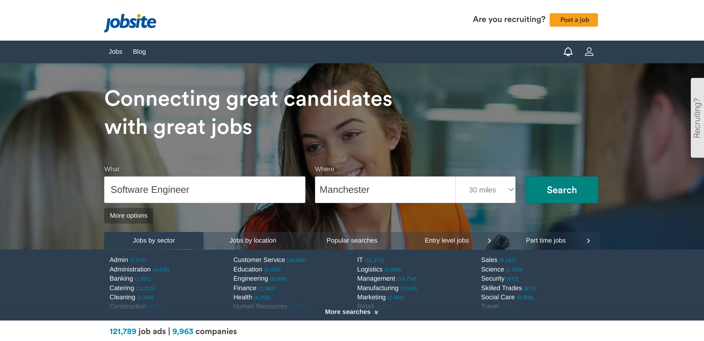
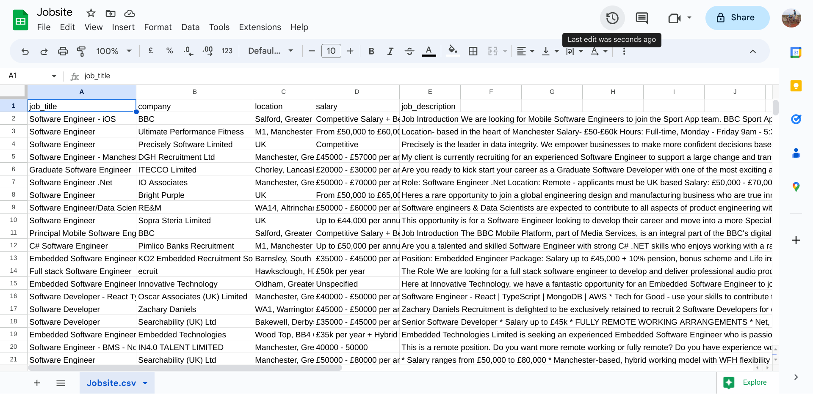

# Gemini API Notebook - Entity extraction from job descriptions with Gemini 1.5 Flash

## About this notebook

In this notebook, using Gemini API (Gemini 1.5 Flash), I will extract certain information from the job description text I have scraped and collected from job search site in the past

In my past project, I have scraped and collected Software Engineer positions advertised on a job search site, for more details, please visit - https://github.com/morikaglobal/jobsite_selenium

Using my scraping code, data is scraped, necessary data processing done and the data gets stored in CSV file like this: <a href="https://github.com/morikaglobal/jobsite_selenium/blob/master/Jobsite.csv" target="_blank">jobsite search result (CSV file)</a>

However, I have noticed that some positions look like they are not related to Software Engineer positions, although the job titles do include 'Software Engineer' phrase, and specific programming languages and skills that is required for each job can only be found when job descriptions are read manually.

Using Gemini 1.5 Flash, I want to identify whether the position is Software Engineer related or not, so that if not, I can remove the positions from the list/dataframe.  At the same time, I want to utilise the Entity Extraction of Gemini API so that I can extract certain information - the actual position that employers are looking for candidates, as well as experience and skills required

I will import and use the data collected from the project above available at - https://github.com/morikaglobal/jobsite_selenium/blob/master/Jobsite.csv

